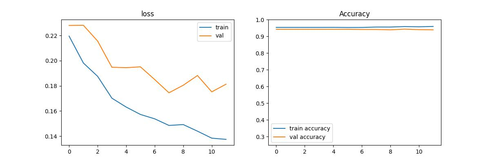

# Project-art

## Description

The project's main goal is about being able to say if 2 differents paintings are drawn by the same artist. but we will be going step by step.

Our first attempt will be about determining the paintings' artist then we will try to say if the painting is from one specific artist and so on.

## Find the artist

In order to make it easier for our model, we will limit the train and analysis only to the 20th most recurrent artist in the dataframe. We will make sure that we have a balanced dataset between each artist.

Here's the list :
- Ivan Aivazovsky
- Gustave Dore
- Rembrant
- Edgar Deas
- Theophile Steinlen
- Albrecht Durer
- Giovanni Battista Piranesi
- Paul Cezanne
- John Singer Sargent
- Vincent van Gogh
- Childe Hassam
- Zdislav Beksinski
- Camille Pissarro
- Eugene Boudin
- Boris Kustodiev
- Ilya Repin
- Pierre-Auguste Renoir
- Martiros Saryan
- Pyotr Konchalovsky
- Pablo Picasso

Unfortunately, even if we resize the picture, our model is not able to predict correctly the artist and has an accuracy at 40% top.

The only good news here is that the model does not overfit.

We were unable to determine the artist (at least yet !) so now we will try to determine if one painting comes from one specific artist.

## Picasso or not?

Let's try our model on a different task. Instead of asking him from which artist comes from one painting, we will request him to tell us if this painting come from the chosen artist, here Picasso, or not.

And it did right because we were able to reach the score of 95% !

What if we give a random Picasso's picture from internet to our model, will he give us the right answer :

The model says it's Picasso !
